# Architecture & Design Specification
# GenAI-Powered Family Task Management System

**Version**: 1.0
**Last Updated**: October 27, 2025
**Status**: Design Phase
**Related Documents**: [PRD.md](./PRD.md), [../PROJECT_CONTEXT.md](../PROJECT_CONTEXT.md)

---

## Table of Contents
1. [System Architecture Overview](#system-architecture-overview)
2. [Agent Architecture](#agent-architecture)
3. [Component Design](#component-design)
4. [Data Architecture](#data-architecture)
5. [API Integration](#api-integration)
6. [UI/UX Architecture](#uiux-architecture)
7. [Security & Privacy](#security--privacy)
8. [Performance & Scalability](#performance--scalability)
9. [Testing Strategy](#testing-strategy)
10. [Deployment Architecture](#deployment-architecture)

---

## System Architecture Overview

### High-Level Architecture

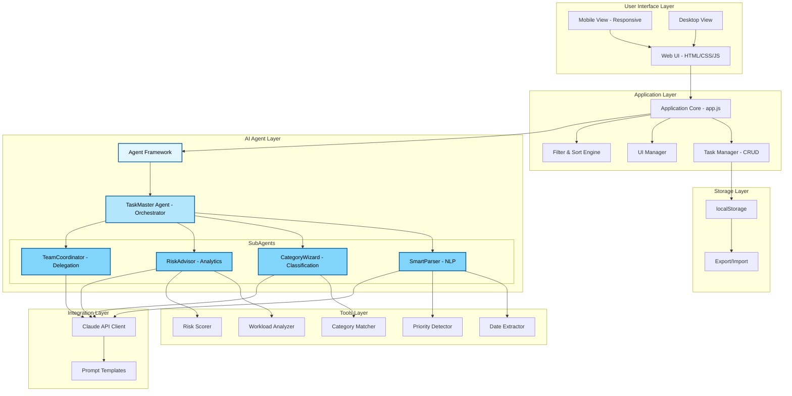

### Architecture Principles

1. **Separation of Concerns**: UI, Business Logic, AI, Storage are independent
2. **Modularity**: Each component can be developed/tested independently
3. **Graceful Degradation**: System works even if AI layer fails
4. **Mobile-First**: Responsive design prioritizes mobile experience
5. **Token Efficiency**: Modular code, clear separation reduces context size

---

## Agent Architecture

### Agent Hierarchy & Orchestration

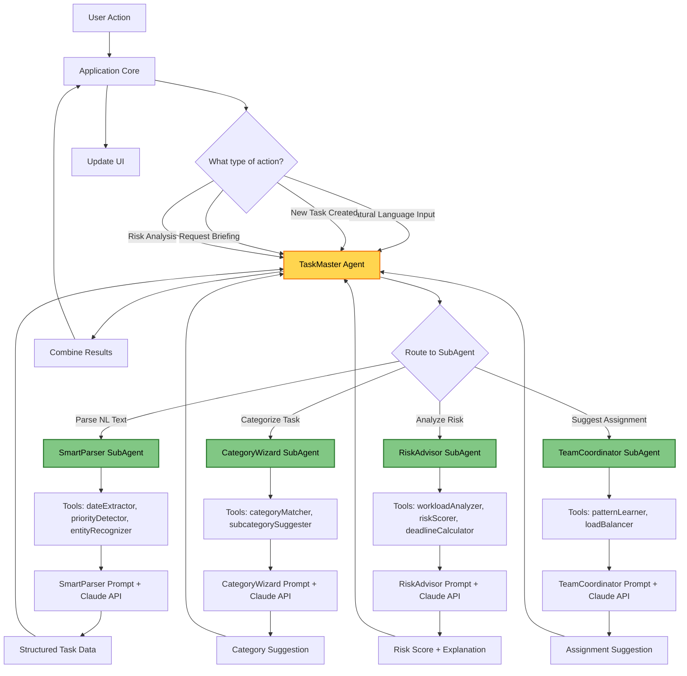

### Agent Communication Patterns

#### Pattern 1: Sequential Processing (NLP Entry)
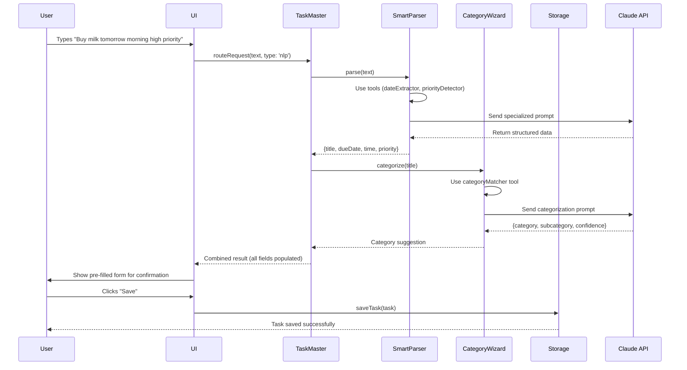

#### Pattern 2: Parallel Processing (Daily Briefing)
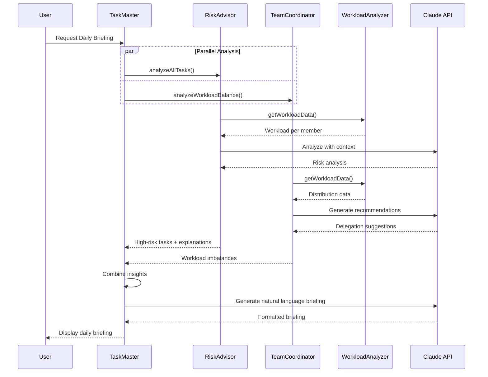

#### Pattern 3: Conditional Routing
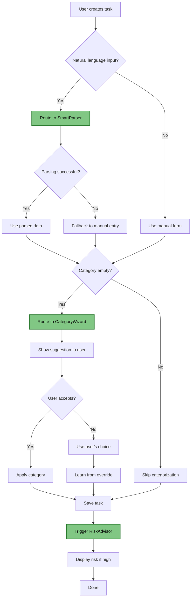

### Agent Class Structure

**Language**: JavaScript (ES6+) - Vanilla JavaScript, no TypeScript or frameworks.

```javascript
// JavaScript ES6+
// Base Agent Class
class Agent {
  constructor(name, tools = []) {
    this.name = name;
    this.tools = tools;
    this.apiClient = new ClaudeAPIClient();
  }

  async execute(input, context = {}) {
    // To be implemented by subclasses
    throw new Error('execute() must be implemented');
  }

  useTool(toolName, input) {
    const tool = this.tools.find(t => t.name === toolName);
    if (!tool) throw new Error(`Tool ${toolName} not found`);
    return tool.execute(input);
  }
}

// TaskMaster Agent (Orchestrator)
class TaskMasterAgent extends Agent {
  constructor() {
    super('TaskMaster', []);
    this.subAgents = {
      smartParser: new SmartParserAgent(),
      categoryWizard: new CategoryWizardAgent(),
      riskAdvisor: new RiskAdvisorAgent(),
      teamCoordinator: new TeamCoordinatorAgent()
    };
  }

  async execute(input, context) {
    // Determine which subagent(s) to invoke
    const actionType = this.determineActionType(input, context);

    switch(actionType) {
      case 'nlp_parse':
        return await this.routeToParser(input);
      case 'categorize':
        return await this.routeToCategorizer(input);
      case 'risk_analysis':
        return await this.routeToRiskAdvisor(input);
      case 'daily_briefing':
        return await this.generateBriefing(input);
      default:
        throw new Error(`Unknown action type: ${actionType}`);
    }
  }

  async routeToParser(text) {
    const parsedData = await this.subAgents.smartParser.execute(text);

    // If parsing succeeded and title exists, also get category suggestion
    if (parsedData.title) {
      const categorySuggestion = await this.subAgents.categoryWizard.execute(parsedData.title);
      return { ...parsedData, ...categorySuggestion };
    }

    return parsedData;
  }

  async generateBriefing(context) {
    // Parallel execution
    const [riskAnalysis, workloadAnalysis] = await Promise.all([
      this.subAgents.riskAdvisor.execute({ tasks: context.allTasks }),
      this.subAgents.teamCoordinator.execute({ tasks: context.allTasks })
    ]);

    // Combine and generate natural language briefing
    const briefingPrompt = this.buildBriefingPrompt(riskAnalysis, workloadAnalysis, context);
    const briefing = await this.apiClient.call(briefingPrompt);

    return briefing;
  }
}

// SmartParser SubAgent
class SmartParserAgent extends Agent {
  constructor() {
    const tools = [
      new DateExtractorTool(),
      new PriorityDetectorTool(),
      new EntityRecognizerTool()
    ];
    super('SmartParser', tools);
  }

  async execute(naturalLanguageText) {
    try {
      // Step 1: Use tools for deterministic extraction
      const extractedDate = this.useTool('dateExtractor', naturalLanguageText);
      const extractedPriority = this.useTool('priorityDetector', naturalLanguageText);

      // Step 2: Use LLM for nuanced understanding
      const prompt = this.buildPrompt(naturalLanguageText, extractedDate, extractedPriority);
      const llmResponse = await this.apiClient.call(prompt);

      // Step 3: Combine tool results with LLM insights
      return this.combineResults(llmResponse, extractedDate, extractedPriority);

    } catch (error) {
      console.error('SmartParser failed:', error);
      // Graceful degradation: return partial results
      return { error: true, message: 'Could not parse fully', partial: true };
    }
  }

  buildPrompt(text, dateHint, priorityHint) {
    return `You are a task parsing specialist. Extract structured data from natural language.

Input: "${text}"

Hints from preliminary analysis:
- Detected date: ${dateHint || 'none'}
- Detected priority: ${priorityHint || 'none'}

Extract the following in JSON format:
{
  "title": "concise task title",
  "description": "additional details if any",
  "dueDate": "YYYY-MM-DD or relative like 'tomorrow'",
  "time": "Morning/Afternoon/Evening/Night or specific time",
  "priority": "High/Medium/Low"
}

Return ONLY valid JSON, no explanation.`;
  }
}

// Note: Default Due Date Behavior
// If no due date is specified or inferred from the input, the system defaults to
// Friday of the current week. This encourages task completion within the week
// while providing a reasonable buffer.
//
// Implementation in DateExtractorTool:
// function inferDueDate(extractedDate) {
//   if (extractedDate) return extractedDate;
//
//   // Default to Friday of current week
//   const today = new Date();
//   const dayOfWeek = today.getDay(); // 0=Sunday, 5=Friday
//   const daysUntilFriday = (5 - dayOfWeek + 7) % 7 || 7; // If today is Friday, use next Friday
//   const friday = new Date(today);
//   friday.setDate(today.getDate() + daysUntilFriday);
//
//   return friday.toISOString().split('T')[0]; // YYYY-MM-DD
// }

// CategoryWizard SubAgent
class CategoryWizardAgent extends Agent {
  constructor() {
    const tools = [
      new CategoryMatcherTool(),
      new SubcategorySuggesterTool()
    ];
    super('CategoryWizard', tools);
  }

  async execute(taskTitle) {
    // Use semantic matching tool first
    const toolSuggestion = this.useTool('categoryMatcher', taskTitle);

    // If confidence is high (>0.8), use tool result
    if (toolSuggestion.confidence > 0.8) {
      return toolSuggestion;
    }

    // Otherwise, consult LLM for nuanced categorization
    const prompt = this.buildPrompt(taskTitle, toolSuggestion);
    const llmResponse = await this.apiClient.call(prompt);

    return llmResponse;
  }

  buildPrompt(taskTitle, toolSuggestion) {
    return `You are a task categorization expert.

Categories:
- Shopping (Groceries, Clothing, Electronics, Other)
- Household (Cleaning, Maintenance, Repairs, Yard Work)
- Bills (Utilities, Phone, Internet, Credit Card)
- Insurance (Health, Auto, Home, Life)
- Investments (Stocks, Retirement, 401k, Real Estate)
- Work (Projects, Meetings, Deadlines, Training)
- Other

Task: "${taskTitle}"

Preliminary suggestion: ${JSON.stringify(toolSuggestion)}

Provide the best category and subcategory.
Return JSON: {"category": "...", "subcategory": "...", "confidence": 0.0-1.0}`;
  }
}

// RiskAdvisor SubAgent
class RiskAdvisorAgent extends Agent {
  constructor() {
    const tools = [
      new WorkloadAnalyzerTool(),
      new RiskScorerTool(),
      new DeadlineCalculatorTool()
    ];
    super('RiskAdvisor', tools);
  }

  async execute(input) {
    const { task, allTasks, currentDate } = input;

    // Use tools to calculate objective metrics
    const workloadData = this.useTool('workloadAnalyzer', { tasks: allTasks });
    const riskScore = this.useTool('riskScorer', { task, workloadData, currentDate });
    const daysRemaining = this.useTool('deadlineCalculator', { task, currentDate });

    // If risk is low, skip LLM call (cost optimization)
    if (riskScore < 40) {
      return {
        riskScore,
        level: 'low',
        explanation: 'Task has adequate time and member has manageable workload.',
        recommendation: null
      };
    }

    // For medium/high risk, get LLM explanation and recommendations
    const prompt = this.buildPrompt(task, workloadData, riskScore, daysRemaining);
    const llmResponse = await this.apiClient.call(prompt);

    return {
      riskScore,
      level: riskScore > 70 ? 'high' : 'medium',
      ...llmResponse
    };
  }

  buildPrompt(task, workloadData, riskScore, daysRemaining) {
    return `You are a task risk analyst.

Task: ${task.title}
Due: ${task.dueDate} (${daysRemaining} days remaining)
Priority: ${task.priority}
Assigned to: ${task.assignedTo}

Workload for ${task.assignedTo}: ${workloadData[task.assignedTo].taskCount} tasks (${workloadData[task.assignedTo].highPriority} high priority)

Risk Score: ${riskScore}/100

Provide:
1. Brief explanation (1-2 sentences) of why this task is at risk
2. Actionable recommendation (optional - only if you have a specific suggestion)

Return JSON: {"explanation": "...", "recommendation": "..." or null}`;
  }
}

// TeamCoordinator SubAgent
class TeamCoordinatorAgent extends Agent {
  constructor() {
    const tools = [
      new PatternLearnerTool(),
      new LoadBalancerTool()
    ];
    super('TeamCoordinator', tools);
  }

  async execute(input) {
    const { task, allTasks } = input;

    // Use tools to find patterns and calculate load
    const patterns = this.useTool('patternLearner', { tasks: allTasks });
    const loadBalance = this.useTool('loadBalancer', { tasks: allTasks });

    // Determine if LLM consultation is needed
    const obviousChoice = this.checkObviousChoice(task, patterns, loadBalance);
    if (obviousChoice) {
      return obviousChoice;
    }

    // Consult LLM for nuanced delegation decision
    const prompt = this.buildPrompt(task, patterns, loadBalance);
    const llmResponse = await this.apiClient.call(prompt);

    return llmResponse;
  }

  checkObviousChoice(task, patterns, loadBalance) {
    // If someone always handles this category and has capacity, suggest them
    const categoryPattern = patterns.byCategory[task.category];
    if (categoryPattern && categoryPattern.confidence > 0.9) {
      const preferredMember = categoryPattern.member;
      if (loadBalance[preferredMember].taskCount < 10) {
        return {
          suggestedAssignee: preferredMember,
          rationale: `${preferredMember} typically handles ${task.category} tasks and has capacity.`,
          confidence: categoryPattern.confidence
        };
      }
    }
    return null;
  }

  buildPrompt(task, patterns, loadBalance) {
    return `You are a task delegation expert.

Task: ${task.title}
Category: ${task.category}

Historical Patterns:
${JSON.stringify(patterns, null, 2)}

Current Workload:
${JSON.stringify(loadBalance, null, 2)}

Suggest the best family member to assign this task to, with rationale.
Return JSON: {"suggestedAssignee": "MemberX", "rationale": "...", "confidence": 0.0-1.0}`;
  }
}
```

---

## Component Design

### File Structure

```
/home/user/ai-demos/
├── index.html                      # Main HTML file
├── PROJECT_CONTEXT.md              # Session continuity
├── README.md                       # Setup instructions
│
├── css/
│   ├── main.css                    # Core styles
│   ├── responsive.css              # Mobile-first responsive design
│   └── themes.css                  # Color themes (optional)
│
├── js/
│   ├── app.js                      # Application entry point
│   ├── config.js                   # Configuration and constants
│   ├── storage.js                  # localStorage wrapper
│   ├── taskManager.js              # Task CRUD operations
│   ├── filterSort.js               # Filtering and sorting logic
│   ├── ui.js                       # UI rendering and updates
│   ├── utils.js                    # Utility functions
│   │
│   ├── agents/                     # AI Agent Framework
│   │   ├── agentFramework.js       # Main framework initialization
│   │   ├── baseAgent.js            # Base Agent class
│   │   ├── taskMasterAgent.js      # Main orchestrator
│   │   ├── smartParser.js          # NLP parsing SubAgent
│   │   ├── categoryWizard.js       # Categorization SubAgent
│   │   ├── riskAdvisor.js          # Risk analysis SubAgent
│   │   └── teamCoordinator.js      # Delegation SubAgent
│   │
│   ├── tools/                      # Agent Tools
│   │   ├── baseTool.js             # Base Tool class
│   │   ├── dateExtractor.js        # Date parsing tool
│   │   ├── priorityDetector.js     # Priority extraction tool
│   │   ├── entityRecognizer.js     # Entity recognition tool
│   │   ├── categoryMatcher.js      # Category matching tool
│   │   ├── workloadAnalyzer.js     # Workload calculation tool
│   │   ├── riskScorer.js           # Risk scoring algorithm
│   │   └── patternLearner.js       # Pattern detection tool
│   │
│   └── ai/                         # AI Integration
│       ├── claudeClient.js         # Claude API wrapper
│       ├── prompts.js              # Prompt templates
│       └── tokenTracker.js         # Usage/cost tracking
│
├── tests/
│   ├── setup.js                    # Test configuration
│   ├── taskManager.test.js         # Task CRUD tests
│   ├── filterSort.test.js          # Filter/sort tests
│   ├── storage.test.js             # Storage tests
│   ├── agents/
│   │   ├── smartParser.test.js
│   │   ├── categoryWizard.test.js
│   │   ├── riskAdvisor.test.js
│   │   └── teamCoordinator.test.js
│   └── tools/
│       ├── dateExtractor.test.js
│       ├── riskScorer.test.js
│       └── workloadAnalyzer.test.js
│
└── docs/
    ├── PRD.md                      # Product Requirements
    └── ARCHITECTURE.md             # This document
```

### Component Interaction Diagram

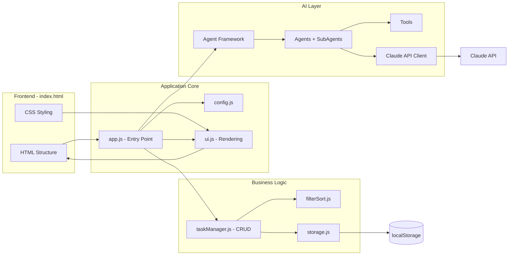

---

## Data Architecture

### Data Models

#### Task Object Schema
```javascript
const TaskSchema = {
  id: {
    type: 'string',
    format: 'uuid-v4',
    required: true,
    generated: true,
    example: '550e8400-e29b-41d4-a716-446655440000'
  },
  title: {
    type: 'string',
    required: true,
    minLength: 1,
    maxLength: 200,
    example: 'Buy groceries'
  },
  description: {
    type: 'string',
    required: false,
    maxLength: 1000,
    example: 'Get milk, bread, eggs from Whole Foods'
  },
  createdBy: {
    type: 'string',
    required: true,
    enum: ['Member1', 'Member2', 'Member3', 'Member4', 'Member5'],
    example: 'Member1'
  },
  assignedTo: {
    type: 'string',
    required: true,
    enum: ['Member1', 'Member2', 'Member3', 'Member4', 'Member5'],
    example: 'Member2'
  },
  category: {
    type: 'string',
    required: true,
    enum: ['Shopping', 'Household', 'Bills', 'Insurance', 'Investments', 'Work', 'Other'],
    example: 'Shopping'
  },
  subcategory: {
    type: 'string',
    required: false,
    maxLength: 50,
    example: 'Groceries'
  },
  priority: {
    type: 'string',
    required: true,
    enum: ['High', 'Medium', 'Low'],
    default: 'Medium',
    example: 'High'
  },
  urgency: {
    type: 'string',
    required: true,
    enum: ['High', 'Medium', 'Low'],
    default: 'Medium',
    example: 'Medium'
  },
  entryDate: {
    type: 'string',
    format: 'ISO-8601-date',
    required: true,
    generated: true,
    example: '2025-10-27'
  },
  dueDate: {
    type: 'string',
    format: 'ISO-8601-date',
    required: true,
    example: '2025-10-30'
  },
  time: {
    type: 'string',
    required: false,
    maxLength: 50,
    example: 'Morning'
  },
  recurrence: {
    type: 'string',
    required: true,
    enum: ['None', 'Daily', 'Weekly', 'Monthly', 'Yearly'],
    default: 'None',
    example: 'None'
  },
  status: {
    type: 'string',
    required: true,
    enum: ['Pending', 'InProgress', 'Completed'],
    default: 'Pending',
    example: 'Pending'
  },
  completionDate: {
    type: 'string',
    format: 'ISO-8601-date',
    required: false,
    nullable: true,
    example: null
  },
  aiSuggestions: {
    type: 'object',
    required: false,
    properties: {
      categoryConfidence: { type: 'number', min: 0, max: 1 },
      riskScore: { type: 'number', min: 0, max: 100 },
      riskExplanation: { type: 'string' },
      suggestedAssignee: { type: 'string' },
      delegationRationale: { type: 'string' }
    }
  }
};
```

### Data Flow Diagram

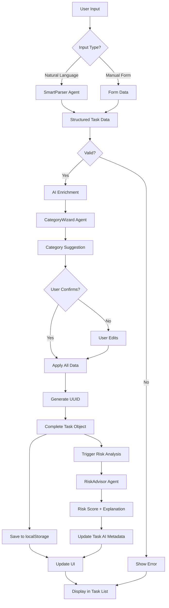

### Storage Schema

```javascript
// localStorage keys and structure
const StorageSchema = {
  'familyTodo_tasks': {
    type: 'array',
    items: 'TaskObject',
    example: [
      { id: 'uuid1', title: 'Task 1', ... },
      { id: 'uuid2', title: 'Task 2', ... }
    ]
  },

  'familyTodo_categories': {
    type: 'object',
    structure: {
      'CategoryName': ['Subcategory1', 'Subcategory2', ...]
    },
    example: {
      'Shopping': ['Groceries', 'Clothing', 'Electronics'],
      'Household': ['Cleaning', 'Maintenance', 'Repairs']
    }
  },

  'familyTodo_settings': {
    type: 'object',
    properties: {
      familyMembers: {
        type: 'array',
        default: ['Member1', 'Member2', 'Member3', 'Member4', 'Member5']
      },
      currentUser: {
        type: 'string',
        default: 'Member1'
      },
      apiKey: {
        type: 'string',
        encrypted: true,
        default: null
      },
      aiEnabled: {
        type: 'boolean',
        default: true
      },
      theme: {
        type: 'string',
        enum: ['light', 'dark'],
        default: 'light'
      }
    }
  },

  'familyTodo_aiUsage': {
    type: 'object',
    properties: {
      totalAPICalls: { type: 'number', default: 0 },
      totalTokensInput: { type: 'number', default: 0 },
      totalTokensOutput: { type: 'number', default: 0 },
      estimatedCost: { type: 'number', default: 0 },
      lastReset: { type: 'string', format: 'ISO-8601' }
    }
  },

  'familyTodo_learningData': {
    type: 'object',
    description: 'Stores user overrides for AI learning',
    properties: {
      categoryOverrides: {
        type: 'array',
        items: {
          taskTitle: 'string',
          aiSuggested: 'string',
          userChose: 'string',
          timestamp: 'string'
        }
      }
    }
  }
};
```

---

## API Integration

### Multi-LLM Provider Abstraction

**Design Philosophy**: Support multiple LLM providers (Claude, OpenAI, local models) with a unified interface. This allows:
- Cost optimization (choose cheaper models for simple tasks)
- Performance tuning (faster models for real-time features)
- Flexibility (switch providers without code changes)
- Demonstration of advanced architecture for portfolio

**Implementation Strategy**:
- **MVP (V1.0)**: Claude only, but with abstraction layer ready
- **V1.1**: Add OpenAI support
- **Future**: Local LLM support (Ollama, etc.)

```javascript
// JavaScript ES6+
// LLM Provider Interface
class LLMProvider {
  async complete(prompt, options) {
    throw new Error('complete() must be implemented by provider');
  }

  async getConfig() {
    return {
      name: this.constructor.name,
      models: [],
      costPerToken: 0
    };
  }
}

// Claude Provider Implementation
class ClaudeProvider extends LLMProvider {
  constructor(apiKey) {
    super();
    this.apiKey = apiKey;
    this.baseURL = 'https://api.anthropic.com/v1/messages';
  }

  async complete(prompt, options = {}) {
    const {
      model = 'claude-3-5-sonnet-20241022',
      maxTokens = 1024,
      temperature = 0.7
    } = options;

    // Implementation details in ClaudeAPIClient below
    const client = new ClaudeAPIClient(this.apiKey);
    return await client.call(prompt, { model, maxTokens, temperature });
  }

  async getConfig() {
    return {
      name: 'Claude',
      models: ['claude-3-5-sonnet-20241022', 'claude-3-haiku-20240307'],
      costPerToken: { sonnet: 0.000015, haiku: 0.000001 }
    };
  }
}

// OpenAI Provider (Future - V1.1)
class OpenAIProvider extends LLMProvider {
  constructor(apiKey) {
    super();
    this.apiKey = apiKey;
    this.baseURL = 'https://api.openai.com/v1/chat/completions';
  }

  async complete(prompt, options = {}) {
    const {
      model = 'gpt-4o-mini',
      maxTokens = 1024,
      temperature = 0.7
    } = options;

    // OpenAI API implementation
    // To be implemented in V1.1
    throw new Error('OpenAI provider not yet implemented');
  }

  async getConfig() {
    return {
      name: 'OpenAI',
      models: ['gpt-4o', 'gpt-4o-mini'],
      costPerToken: { 'gpt-4o': 0.00001, 'gpt-4o-mini': 0.000001 }
    };
  }
}

// Configuration: Which provider for which agent
const AI_CONFIG = {
  SmartParser: {
    provider: 'claude',
    model: 'claude-3-5-sonnet-20241022'
  },
  CategoryWizard: {
    provider: 'claude',
    model: 'claude-3-haiku-20240307' // Simpler task, cheaper model
  },
  RiskAdvisor: {
    provider: 'claude',
    model: 'claude-3-haiku-20240307'
  },
  TeamCoordinator: {
    provider: 'claude',
    model: 'claude-3-haiku-20240307'
  }
};

// Provider Factory
class LLMProviderFactory {
  static providers = new Map();

  static register(name, provider) {
    this.providers.set(name.toLowerCase(), provider);
  }

  static getProvider(name) {
    const provider = this.providers.get(name.toLowerCase());
    if (!provider) {
      throw new Error(`Provider ${name} not registered`);
    }
    return provider;
  }
}

// Usage in Agent
class Agent {
  constructor(name, tools = []) {
    this.name = name;
    this.tools = tools;

    // Get provider from config
    const config = AI_CONFIG[name] || { provider: 'claude' };
    const provider = LLMProviderFactory.getProvider(config.provider);
    this.llmClient = provider;
    this.modelConfig = config;
  }

  async callLLM(prompt) {
    return await this.llmClient.complete(prompt, {
      model: this.modelConfig.model,
      maxTokens: 1024,
      temperature: 0.7
    });
  }
}
```

**Benefits**:
1. **Extensibility**: New providers can be added without changing agents
2. **Cost Optimization**: Use Haiku for simple tasks, Sonnet for complex
3. **Testability**: Easy to mock providers for testing
4. **Portfolio Value**: Shows advanced software engineering practices

**Effort**: ~2-3 hours to implement abstraction layer (done upfront in MVP)

---

### Claude API Architecture

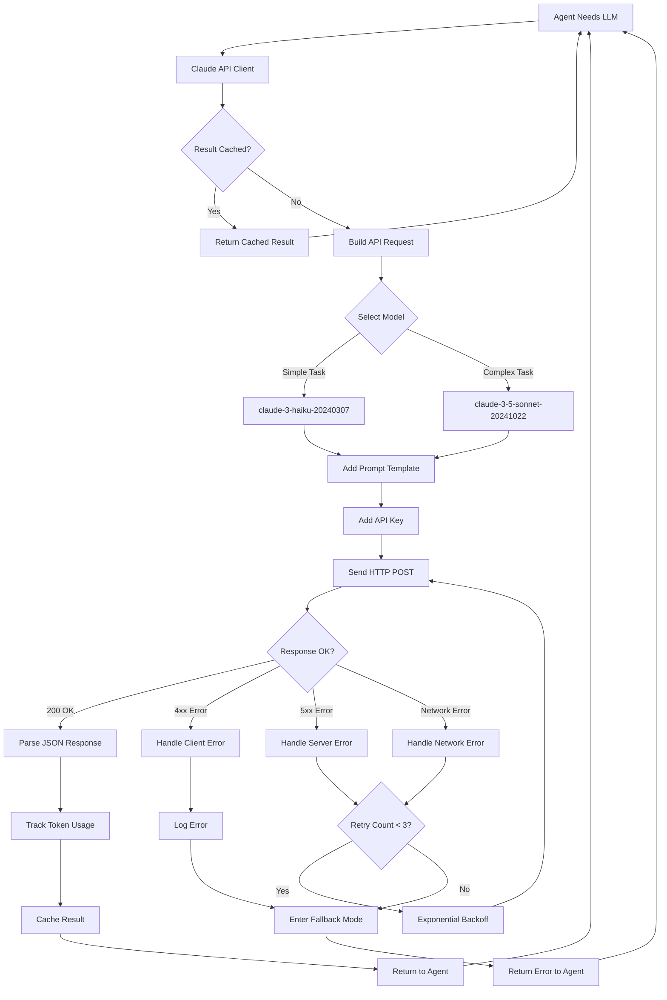

### API Client Implementation

```javascript
class ClaudeAPIClient {
  constructor(apiKey) {
    this.apiKey = apiKey;
    this.baseURL = 'https://api.anthropic.com/v1/messages';
    this.cache = new Map(); // Simple in-memory cache
    this.usageTracker = new TokenUsageTracker();
  }

  async call(prompt, options = {}) {
    const {
      model = 'claude-3-5-sonnet-20241022',
      maxTokens = 1024,
      temperature = 0.7,
      cacheKey = null,
      bypassCache = false
    } = options;

    // Check cache
    if (cacheKey && !bypassCache && this.cache.has(cacheKey)) {
      console.log(`Cache hit for key: ${cacheKey}`);
      return this.cache.get(cacheKey);
    }

    // Build request
    const requestBody = {
      model,
      max_tokens: maxTokens,
      temperature,
      messages: [{
        role: 'user',
        content: prompt
      }]
    };

    // Send request with retry logic
    const response = await this.sendWithRetry(requestBody);

    // Track usage
    this.usageTracker.track({
      inputTokens: response.usage.input_tokens,
      outputTokens: response.usage.output_tokens,
      model
    });

    // Extract content
    const result = response.content[0].text;

    // Cache result
    if (cacheKey) {
      this.cache.set(cacheKey, result);
    }

    return result;
  }

  async sendWithRetry(requestBody, maxRetries = 3) {
    let lastError;

    for (let attempt = 0; attempt < maxRetries; attempt++) {
      try {
        const response = await fetch(this.baseURL, {
          method: 'POST',
          headers: {
            'Content-Type': 'application/json',
            'x-api-key': this.apiKey,
            'anthropic-version': '2023-06-01'
          },
          body: JSON.stringify(requestBody)
        });

        if (!response.ok) {
          const errorData = await response.json();
          throw new APIError(response.status, errorData);
        }

        return await response.json();

      } catch (error) {
        lastError = error;

        // Don't retry client errors (4xx)
        if (error.status >= 400 && error.status < 500) {
          throw error;
        }

        // Exponential backoff for server errors
        if (attempt < maxRetries - 1) {
          const backoffMs = Math.pow(2, attempt) * 1000; // 1s, 2s, 4s
          console.warn(`Retry ${attempt + 1}/${maxRetries} after ${backoffMs}ms`);
          await this.sleep(backoffMs);
        }
      }
    }

    throw new Error(`Max retries exceeded. Last error: ${lastError.message}`);
  }

  sleep(ms) {
    return new Promise(resolve => setTimeout(resolve, ms));
  }
}

class TokenUsageTracker {
  constructor() {
    this.loadFromStorage();
  }

  track({ inputTokens, outputTokens, model }) {
    this.data.totalAPICalls++;
    this.data.totalTokensInput += inputTokens;
    this.data.totalTokensOutput += outputTokens;

    // Calculate cost (approximate rates)
    const rates = {
      'claude-3-5-sonnet-20241022': { input: 0.003, output: 0.015 }, // per 1K tokens
      'claude-3-haiku-20240307': { input: 0.00025, output: 0.00125 }
    };

    const rate = rates[model] || rates['claude-3-5-sonnet-20241022'];
    const cost = (inputTokens / 1000 * rate.input) + (outputTokens / 1000 * rate.output);
    this.data.estimatedCost += cost;

    this.saveToStorage();
  }

  loadFromStorage() {
    const stored = localStorage.getItem('familyTodo_aiUsage');
    this.data = stored ? JSON.parse(stored) : {
      totalAPICalls: 0,
      totalTokensInput: 0,
      totalTokensOutput: 0,
      estimatedCost: 0,
      lastReset: new Date().toISOString()
    };
  }

  saveToStorage() {
    localStorage.setItem('familyTodo_aiUsage', JSON.stringify(this.data));
  }

  getStats() {
    return { ...this.data };
  }

  reset() {
    this.data = {
      totalAPICalls: 0,
      totalTokensInput: 0,
      totalTokensOutput: 0,
      estimatedCost: 0,
      lastReset: new Date().toISOString()
    };
    this.saveToStorage();
  }
}
```

### Prompt Templates

```javascript
const PromptTemplates = {
  smartParser: (text, hints = {}) => `You are a task parsing specialist. Extract structured data from natural language input.

Examples:
Input: "Buy milk tomorrow morning"
Output: {"title": "Buy milk", "dueDate": "tomorrow", "time": "Morning"}

Input: "Pay electric bill next Friday, high priority"
Output: {"title": "Pay electric bill", "dueDate": "next Friday", "priority": "High"}

Input: "Call dentist to schedule cleaning sometime this week"
Output: {"title": "Call dentist to schedule cleaning", "dueDate": "this week", "time": null}

Hints from preliminary analysis:
- Detected date: ${hints.date || 'none'}
- Detected priority: ${hints.priority || 'none'}

Now parse this input: "${text}"

Extract the following fields in JSON format:
{
  "title": "concise task title (required)",
  "description": "additional details (optional)",
  "dueDate": "YYYY-MM-DD or relative like 'tomorrow' (required)",
  "time": "Morning/Afternoon/Evening/Night or specific time (optional)",
  "priority": "High/Medium/Low (optional)",
  "urgency": "High/Medium/Low (optional)"
}

Return ONLY valid JSON, no explanation or markdown formatting.`,

  categoryWizard: (taskTitle, availableCategories) => `You are a task categorization expert. Suggest the best category and subcategory for this task.

Available categories and subcategories:
${JSON.stringify(availableCategories, null, 2)}

Task: "${taskTitle}"

Analyze the task and suggest the most appropriate category and subcategory.
Consider:
- The main domain of the task
- Common sense categorization
- If unsure, use "Other" category

Return JSON format:
{
  "category": "exact category name from available list",
  "subcategory": "exact subcategory name or new one if appropriate",
  "confidence": 0.0-1.0
}

Return ONLY valid JSON, no explanation.`,

  riskAdvisor: (task, workloadData, currentDate) => `You are a task risk analyst. Analyze this task and provide risk assessment.

Current Date: ${currentDate}

Task Details:
- Title: ${task.title}
- Due Date: ${task.dueDate}
- Priority: ${task.priority}
- Urgency: ${task.urgency}
- Assigned To: ${task.assignedTo}

Workload for ${task.assignedTo}:
- Total pending tasks: ${workloadData.taskCount}
- High priority tasks: ${workloadData.highPriority}
- Tasks due this week: ${workloadData.dueThisWeek}

Analyze the risk of this task missing its deadline. Consider:
- Time remaining until due date
- Task priority and urgency
- Assignee's current workload
- Complexity implied by the task title

Provide:
1. Brief explanation (1-2 sentences) of the risk factors
2. Specific recommendation (only if there's a clear action to take, otherwise null)

Return JSON:
{
  "explanation": "brief risk analysis",
  "recommendation": "specific suggestion or null"
}

Return ONLY valid JSON, no explanation.`,

  dailyBriefing: (context) => `You are a productivity assistant. Generate a daily briefing for ${context.currentUser}.

Today's Date: ${context.currentDate}

Tasks Overview:
- Total pending: ${context.stats.totalPending}
- Due today: ${context.stats.dueToday}
- Overdue: ${context.stats.overdue}
- High priority: ${context.stats.highPriority}

High-Risk Tasks:
${context.highRiskTasks.map(t => `- ${t.title} (due ${t.dueDate}, risk: ${t.riskScore}/100)`).join('\n')}

Workload Distribution:
${Object.entries(context.workloadByMember).map(([member, load]) => `- ${member}: ${load} tasks`).join('\n')}

Generate a natural language briefing that:
1. Summarizes what's important today
2. Highlights any urgent or at-risk items
3. Suggests priorities or actions
4. Mentions any workload imbalances

Keep it concise (3-5 sentences), actionable, and conversational.

Return ONLY the briefing text, no JSON, no formatting.`,

  teamCoordinator: (task, patterns, workloadBalance) => `You are a task delegation expert. Suggest the best family member to handle this task.

Task:
- Title: ${task.title}
- Category: ${task.category}
- Subcategory: ${task.subcategory || 'none'}
- Priority: ${task.priority}

Historical Patterns (who typically handles what):
${JSON.stringify(patterns, null, 2)}

Current Workload:
${Object.entries(workloadBalance).map(([member, data]) =>
  `- ${member}: ${data.taskCount} tasks (${data.highPriority} high priority)`
).join('\n')}

Consider:
- Who has handled similar tasks before
- Current workload balance
- Task priority

Suggest the best assignee with clear rationale.

Return JSON:
{
  "suggestedAssignee": "Member name",
  "rationale": "brief explanation (1 sentence)",
  "confidence": 0.0-1.0
}

Return ONLY valid JSON, no explanation.`
};
```

---

## UI/UX Architecture

### Mobile-First Responsive Design

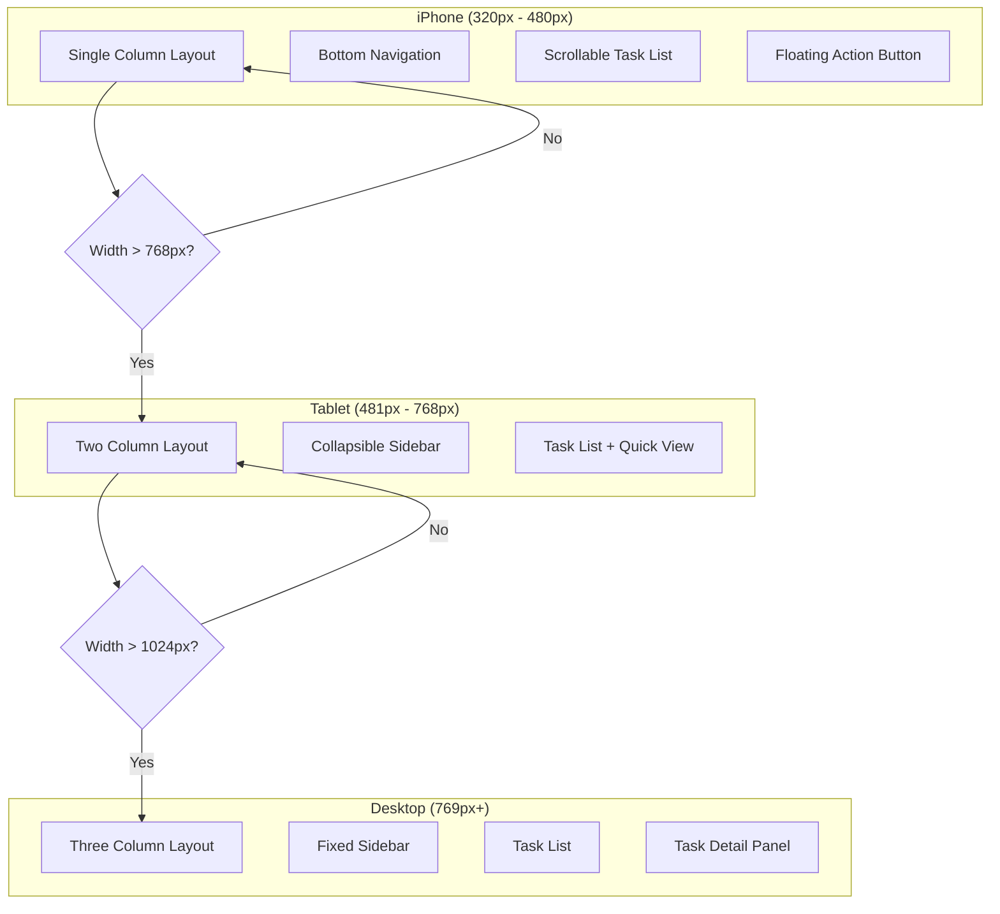

### UI Component Hierarchy

```
App Container
│
├── Header
│   ├── App Title
│   ├── Current User Selector (dropdown)
│   └── Stats Bar (pending, overdue, completed today)
│
├── Main Content Area
│   │
│   ├── Control Panel
│   │   ├── Add Task Button (opens modal)
│   │   ├── AI Features Section
│   │   │   ├── Natural Language Input
│   │   │   ├── Daily Briefing Button
│   │   │   └── Show High-Risk Tasks Toggle
│   │   ├── Filter Controls
│   │   │   ├── By Member (dropdown)
│   │   │   ├── By Status (dropdown)
│   │   │   ├── By Category (dropdown)
│   │   │   ├── By Priority (dropdown)
│   │   │   ├── By Urgency (dropdown)
│   │   │   └── By Date Range (date picker)
│   │   └── Sort Controls
│   │       ├── Sort By (dropdown: date/priority/urgency/category/member)
│   │       └── Sort Order (asc/desc toggle)
│   │
│   └── Task Display Area
│       ├── Task List View
│       │   └── Task Cards (repeating)
│       │       ├── Title
│       │       ├── Assigned To (avatar/name)
│       │       ├── Category Badge
│       │       ├── Priority Indicator (color)
│       │       ├── Urgency Indicator (color)
│       │       ├── Due Date
│       │       ├── Risk Indicator (if AI enabled)
│       │       ├── Status Checkbox
│       │       └── Actions (edit, delete)
│       │
│       └── Empty State (when no tasks match filters)
│
├── Task Modal (for add/edit)
│   ├── Form Fields
│   │   ├── Title (text input)
│   │   ├── Description (textarea)
│   │   ├── Assigned To (dropdown)
│   │   ├── Category (dropdown)
│   │   ├── Subcategory (dropdown, dynamic based on category)
│   │   ├── Priority (radio buttons: H/M/L)
│   │   ├── Urgency (radio buttons: H/M/L)
│   │   ├── Due Date (date picker)
│   │   ├── Time (text input)
│   │   └── Recurrence (dropdown)
│   ├── AI Suggestions Panel (if AI suggestions available)
│   │   ├── Suggested Category (with accept/reject)
│   │   └── Risk Warning (if applicable)
│   └── Actions
│       ├── Save Button
│       ├── Cancel Button
│       └── Delete Button (edit mode only)
│
├── Settings Modal
│   ├── Family Members Section
│   │   ├── Member Name Inputs (editable)
│   │   └── Add/Remove Members
│   ├── AI Configuration
│   │   ├── API Key Input (password field)
│   │   ├── Enable/Disable AI Toggle
│   │   └── AI Usage Stats Display
│   ├── Categories Management
│   │   ├── Add Custom Category
│   │   ├── Edit Subcategories
│   │   └── Delete Unused Categories
│   ├── Data Management
│   │   ├── Export Data Button
│   │   ├── Import Data Button
│   │   └── Clear All Data Button
│   └── Theme Selector (optional)
│
└── Footer
    ├── Export/Import Quick Actions
    ├── Settings Button
    └── Version Info
```

### Color Coding System

```css
/* Priority Colors */
.priority-high {
  border-left: 4px solid #d32f2f; /* Red */
  background-color: #ffebee;
}

.priority-medium {
  border-left: 4px solid #f57c00; /* Orange */
  background-color: #fff3e0;
}

.priority-low {
  border-left: 4px solid #1976d2; /* Blue */
  background-color: #e3f2fd;
}

/* Status Colors */
.status-pending {
  background-color: #fff9c4; /* Light yellow */
}

.status-inprogress {
  background-color: #e1f5fe; /* Light blue */
}

.status-completed {
  background-color: #c8e6c9; /* Light green */
  opacity: 0.7;
  text-decoration: line-through;
}

.status-overdue {
  border: 2px solid #d32f2f;
  background-color: #ffcdd2; /* Light red */
}

/* Risk Indicators */
.risk-high::before {
  content: '🚨';
  margin-right: 8px;
}

.risk-medium::before {
  content: '⚠️';
  margin-right: 8px;
}

/* Category Badges */
.category-shopping { background-color: #4caf50; color: white; }
.category-household { background-color: #9c27b0; color: white; }
.category-bills { background-color: #f44336; color: white; }
.category-insurance { background-color: #2196f3; color: white; }
.category-investments { background-color: #ff9800; color: white; }
.category-work { background-color: #607d8b; color: white; }
.category-other { background-color: #9e9e9e; color: white; }
```

---

## Security & Privacy

### Security Considerations

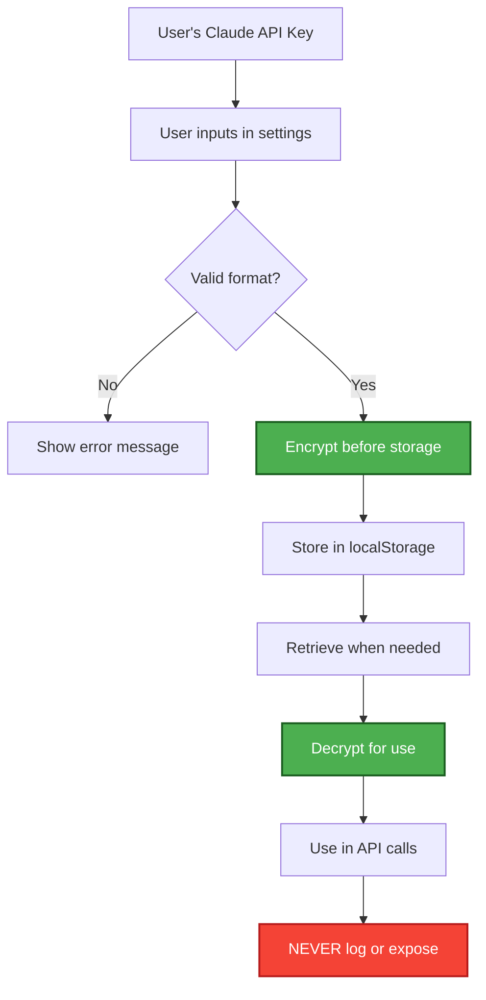

### Security Measures

1. **API Key Protection**
   - Simple encryption before localStorage (base64 + obfuscation)
   - Never logged or exposed in UI
   - Not included in export files by default
   - User prompted to re-enter after import

2. **Input Sanitization**
   - All user inputs sanitized before display (prevent XSS)
   - HTML entities encoded
   - Script tags stripped

3. **Data Privacy**
   - All data stays local (localStorage)
   - Only task content sent to Claude API (no personal identifiers)
   - API calls over HTTPS only
   - No third-party analytics or tracking

4. **Export/Import Security**
   - Optional password protection for export files
   - Validation on import to prevent malicious data
   - User confirmation before overwriting existing data

---

## Performance & Scalability

### Performance Targets

| Metric | Target | Measurement |
|--------|--------|-------------|
| Initial Load | < 2s | Time to interactive |
| Task Add (no AI) | < 100ms | Click to UI update |
| Task Add (with AI) | < 3s | Click to UI update |
| Filter/Sort | < 200ms | Click to re-render |
| 1000 tasks | No lag | Smooth scrolling |

### Optimization Strategies

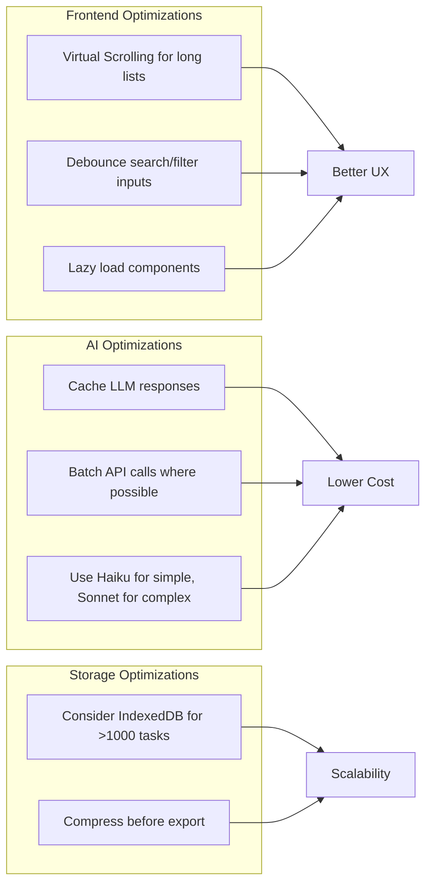

---

## Testing Strategy

### Test Coverage

```mermaid
graph TB
    subgraph "Unit Tests"
        UT1[Task CRUD operations]
        UT2[Filter/Sort functions]
        UT3[Date calculations]
        UT4[Validation logic]
        UT5[Storage operations]
    end

    subgraph "Agent Tests"
        AT1[SmartParser parsing accuracy]
        AT2[CategoryWizard suggestions]
        AT3[RiskAdvisor scoring]
        AT4[TeamCoordinator logic]
    end

    subgraph "Tool Tests"
        TT1[Date extractor]
        TT2[Priority detector]
        TT3[Risk scorer algorithm]
        TT4[Workload analyzer]
    end

    subgraph "Integration Tests"
        IT1[Full task creation flow]
        IT2[AI-assisted entry end-to-end]
        IT3[Daily briefing generation]
        IT4[Export/Import roundtrip]
    end

    subgraph "Manual Tests"
        MT1[iPhone Chrome - Primary]
        MT2[Mac Chrome - Secondary]
        MT3[iPhone Safari - Tertiary]
        MT4[AI fallback behavior]
        MT5[User workflows]
    end

    UT1 & UT2 & UT3 & UT4 & UT5 --> Coverage80[>80% Code Coverage]
    AT1 & AT2 & AT3 & AT4 --> AIQuality[AI Quality Assurance]
    TT1 & TT2 & TT3 & TT4 --> ToolReliability[Tool Reliability]
    IT1 & IT2 & IT3 & IT4 --> EndToEnd[End-to-End Validation]
    MT1 & MT2 & MT3 & MT4 --> UXValidation[UX Validation]
```

### Test Examples

```javascript
// Unit Test: Task Creation
describe('TaskManager', () => {
  test('should create task with valid data', () => {
    const task = createTask({
      title: 'Test task',
      assignedTo: 'Member1',
      category: 'Shopping',
      priority: 'High',
      dueDate: '2025-10-30'
    });

    expect(task).toHaveProperty('id');
    expect(task.title).toBe('Test task');
    expect(task.status).toBe('Pending');
  });

  test('should reject task with missing required fields', () => {
    expect(() => {
      createTask({ title: 'Test' }); // Missing assignedTo, category, dueDate
    }).toThrow('Missing required fields');
  });
});

// Agent Behavior Test: SmartParser
describe('SmartParser Agent', () => {
  test('should parse natural language correctly', async () => {
    const parser = new SmartParserAgent();
    const result = await parser.execute('Buy milk tomorrow morning high priority');

    expect(result.title).toBe('Buy milk');
    expect(result.priority).toBe('High');
    expect(result.time).toContain('morning');
    // Date parsing depends on current date, so check format
    expect(result.dueDate).toMatch(/^\d{4}-\d{2}-\d{2}$/);
  });

  test('should handle ambiguous input gracefully', async () => {
    const parser = new SmartParserAgent();
    const result = await parser.execute('something');

    // Should either parse partially or indicate error
    expect(result).toHaveProperty('title');
    if (result.error) {
      expect(result.partial).toBe(true);
    }
  });
});

// Tool Test: Risk Scorer
describe('Risk Scorer Tool', () => {
  test('should score high risk for overdue high priority task', () => {
    const task = {
      dueDate: '2025-10-20', // Past date
      priority: 'High',
      assignedTo: 'Member1'
    };

    const workload = {
      Member1: { taskCount: 10, highPriority: 5 }
    };

    const currentDate = '2025-10-27';
    const score = riskScorer.calculate(task, workload, currentDate);

    expect(score).toBeGreaterThan(70); // High risk
  });

  test('should score low risk for future low priority task', () => {
    const task = {
      dueDate: '2025-11-15', // Future date
      priority: 'Low',
      assignedTo: 'Member2'
    };

    const workload = {
      Member2: { taskCount: 2, highPriority: 0 }
    };

    const currentDate = '2025-10-27';
    const score = riskScorer.calculate(task, workload, currentDate);

    expect(score).toBeLessThan(30); // Low risk
  });
});
```

---

## Deployment Architecture

### Phase 1: Local HTML File

```
Development → Build → Single HTML File
                         ↓
            User opens in browser (Safari/Chrome)
                         ↓
                 localStorage on user's device
```

**Pros**:
- Instant deployment (no server needed)
- Works offline
- Easy to share (send HTML file)

**Cons**:
- No cross-device sync (without export/import)
- localStorage size limits (~5-10MB)

### Phase 2: GitHub Pages (Optional)

```
Development → Push to GitHub → GitHub Pages hosts
                                      ↓
                  User visits https://hemank.github.io/ai-demos
                                      ↓
                            Same localStorage limitations
```

**Pros**:
- Professional URL for portfolio
- Easy to demo to employers
- Version controlled

### Phase 3: Backend Integration (Future)

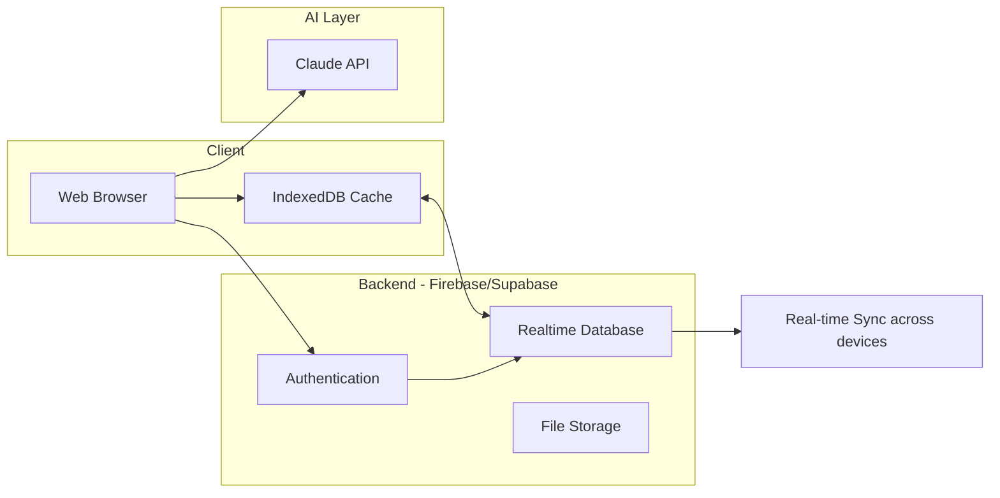

---

## Next Steps

### Development Roadmap

1. **✅ Documentation Complete**
   - [x] PRD
   - [x] PROJECT_CONTEXT.md
   - [x] ARCHITECTURE.md (this document)

2. **⏭️ Setup Phase** (Next)
   - [ ] Create file structure
   - [ ] Set up configuration
   - [ ] Initialize constants

3. **🔨 Implementation Phase**
   - [ ] Core task management (CRUD)
   - [ ] Storage layer
   - [ ] UI components
   - [ ] Agent framework
   - [ ] SmartParser (Priority 1)
   - [ ] Daily Briefing (Priority 2)
   - [ ] RiskAdvisor (Priority 3)
   - [ ] CategoryWizard
   - [ ] TeamCoordinator (optional)

4. **🧪 Testing Phase**
   - [ ] Unit tests
   - [ ] Agent behavior tests
   - [ ] Integration tests
   - [ ] Manual testing on iPhone Chrome (primary), Mac Chrome (secondary), iPhone Safari (tertiary)

5. **📦 Deployment**
   - [ ] Create single HTML build
   - [ ] Test locally
   - [ ] Optional: Deploy to GitHub Pages
   - [ ] Document setup instructions in README

---

## Conclusion

This architecture provides:

✅ **Clear separation of concerns** (UI, Business Logic, AI, Storage)
✅ **Modular agent framework** (easy to add/remove agents)
✅ **Graceful degradation** (works without AI)
✅ **Mobile-first design** (iPhone Chrome primary, Mac Chrome secondary, iPhone Safari tertiary)
✅ **Production considerations** (error handling, caching, cost tracking)
✅ **Testability** (unit tests, agent tests, integration tests)
✅ **Scalability** (can add backend later without major refactor)

**Ready for implementation!** 🚀

---

**Document Version**: 1.0
**Last Updated**: October 27, 2025
**Status**: Ready for Development
**Next**: Await user approval, then begin implementation
